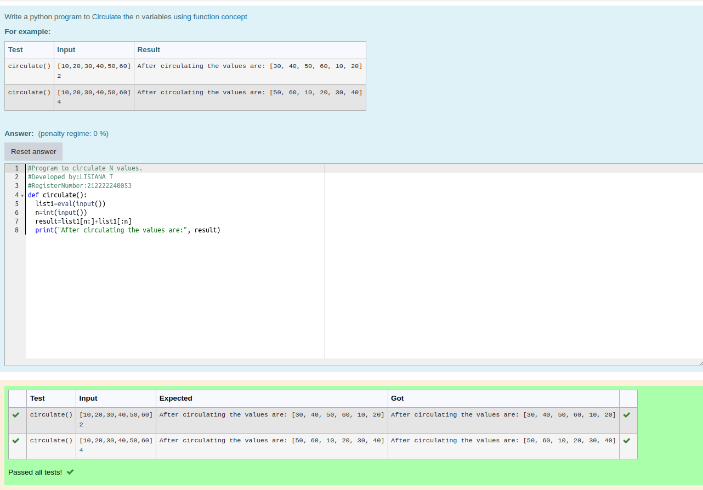

# Circulate-the-values-of-N-variables
## Aim:
To write a python program to circulate the n variables using function concept
## Equipment’s required:
PC
Anaconda - Python 3.7
## Algorithm: 
### Step 1: 
Get the value from the user for the list
### Step 2: 
Get the value from the user for thenumber of rotation
### Step 3: 
Define the function circulate
### Step 4: 
Using the slicing concept rotate the list
### Step 5: 
Print the circulated values
### Step 6: 
End the program
## Program:
```
#Program to circulate N values.
#Developed by:LISIANA T
#RegisterNumber:212222240053
def circulate():
  list1=eval(input())
  n=int(input())
  result=list1[n:]+list1[:n]
  print("After circulating the values are:", result)

```

## Output:
 

## Result:

Thus the circulate of n variables has been executed